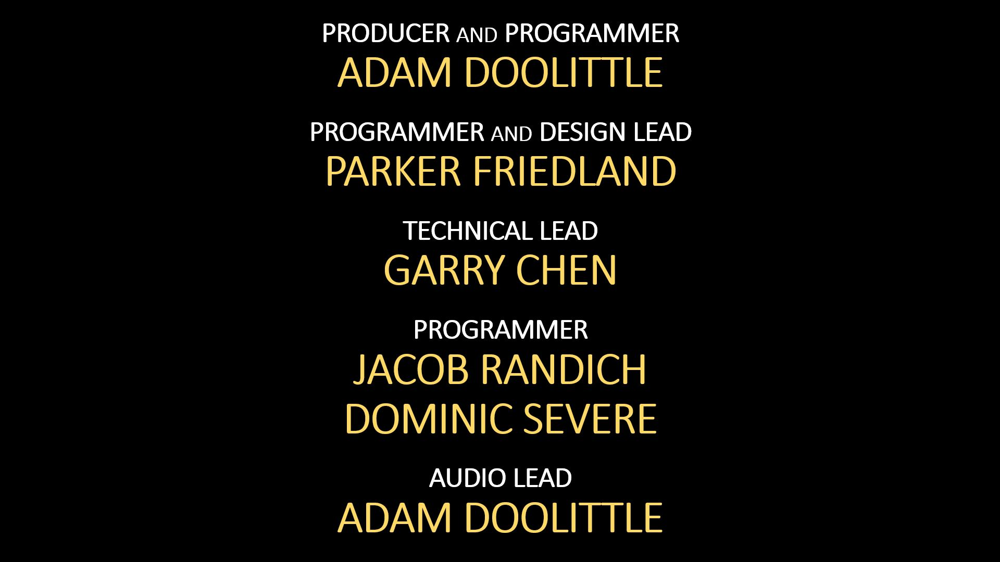

<!-- PROJECT LOGO -->
 

    
  </a>

  <h3 align="center">My Sophomore Year Game Team Project</h3>

  

    <a href="https://youtu.be/wZfhKU2dswQ">Demo video</a>
  

<!-- TABLE OF CONTENTS -->

  
Table of Contents

  <ol>
    <li>
      <a href="#about-the-project">About The Project</a>
      <ul>
        <li><a href="#built-with">Built With</a></li>
      </ul>
    </li>
    <li>
      <a href="#roadmap">Roadmap</a>
    </li>
    <li><a href="#copyright">Copyright</a></li>
    <li><a href="#contact">Contact</a></li>
  </ol>

<!-- ABOUT THE PROJECT -->
## About The Project

![Product Name Screen Shot][product-screenshot]

In this project, we build our custom engine game with ECS design. I learned how to utilize data oriented designed system. I also honored to be promote to tech lead due to pervious tech lead dropping the class.

The game's original goal is a "top-down resource-based shooter," but we were caught up in making systems we lost time to improve the gameplay element. However, I gained tremendous among of technical experience making this project. 

### Built With

This project was build with custom ECS engine intergrated with following 3rd party libraries.

* [OpenGL glm](https://glm.g-truc.net/0.9.9/)
* [RTTR](https://www.rttr.org/)
* [FMOD](https://www.fmod.com/)

<!-- ROADMAP -->
## Roadmap

List of features I implemented for this project.

* designed data oriented game engine (ECS) 
* integrated RTTR (c++ reflection library)
* serialization system using RTTR
* component system template 
* Entity management system
* various enemy behavior
* weapon behaviors suiting for both player and enemy 
* wave spawning system with json support

List of things I did as tech lead.

* establishing coding stander 
* helped refactoring object oriented collision system into ECS designed engine
* helped implementing/debugging various graphic systems (shader, particle, openGL integration)
* helped any trouble integrating to our ECS engine 

<!-- copyright -->
## Copyright

Copyright © 2019 DigiPen, All rights reserved.

<!-- CREDITS -->
## Credits

<!-- CONTACT -->
## Contact

Garry Chen

 

<!-- MARKDOWN LINKS & IMAGES -->
<!-- https://www.markdownguide.org/basic-syntax/#reference-style-links -->
[linkedin-url]: https://linkedin.com/in/othneildrew
[product-screenshot]: pic/vlcsnap-2021-05-28-16h44m11s365.png

